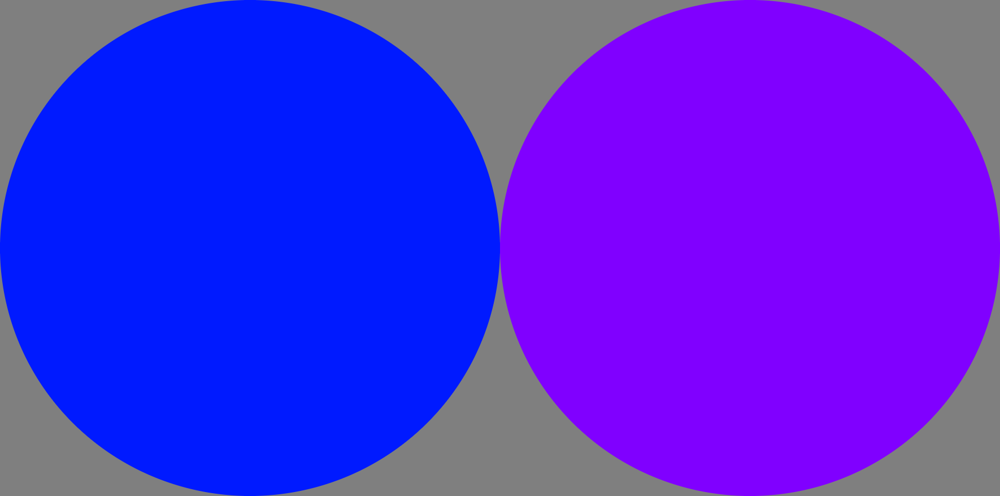
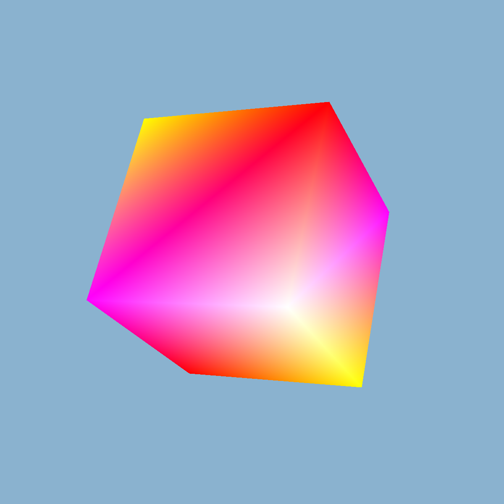
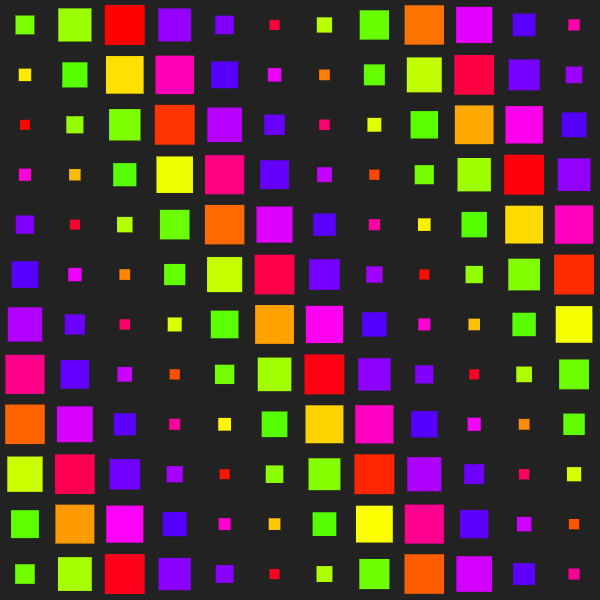

# sketch-wrapper-examples

A collection of sketches that demonstrate the use of [`sketch-wrapper`](https://github.com/cdaein/sketch-wrapper) and other libraries used together.

## How to run

1. Download or clone this repo to your machine.
1. Intall the dependencies by running `npm install` in your Terminal. You need to have Node.js installed on your computer.
1. In the `examples` folder, there are both TypeScript and JavaScript sketches. JS sketches are compiled from TS. To run any of the sketches, update the `<script>` tag in `index.html` to point to a JS or TS sketh.
1. To run the sketch, in the Terminal, run `npm start`. The repo uses Vite.js for dev server.

## Outputs

|             2d-basic             |             2d-resize              |             ogl-cube             |             pts-grid             |
| :------------------------------: | :--------------------------------: | :------------------------------: | :------------------------------: |
|  |  |  |  |
